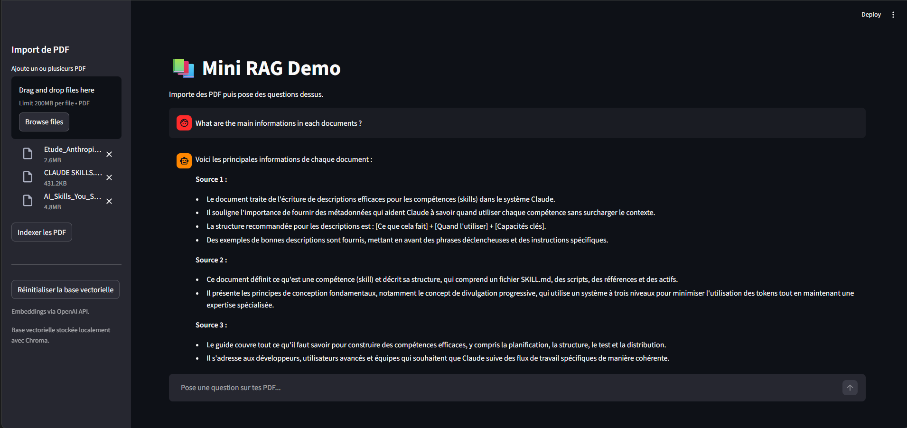

# **RAG Assistant from scratch**




## **Context** :

This repo is a personal challenge i've been working on to learn the fundamentals of RAG development.
Basically, the project main goal is to implement the 5 main phases (at least the way I see it) of a RAG system, which are :

- **File loading** (loading context files, may include pdfs, imgs, videos, ...) : for this project i focused on pdf to practice text extraction.

- **Text Extraction**: that part seems simple at first but while building it from scratch, i've discovered the wide aspects of extraction patterns to consider, as input files sometimes contain unsupported or non-numeric characters and format. So as the engineer i've learned to handle those.
  
- **Chunking**: The point is to cut the different parts of the text we previously extracted into smaller sections called _"chunks"_. That way we prevent size issues, save costs and optimize performance for the embedding phase. For this project, i've been using **character-based chunking with overlap**, which cuts the text every 1000 characters while keeping a 200-character overlap between chunks to preserve coherence and context across boundaries.

- **Embedding**: Now we're being serious ! This phase focuses on _embedding_ the raw content, which basically means moving from _text_ format (eg. **'hello'**) to a _vector_ (eg. **[0.4, 0.7]**). This way we can capture the semantic sense of the text we're giving to the LLM, that way it'll be able to understand it and provide precise and coherent answers. This process normally requires a series of advanced mathematical operations (which takes time !) but hopefully, scientists got us covered ! Thanks to what we call _embedding models_, we are able to simplify this whole process by simply calling an API or importing a dedicated library, then the model will automatically proceed. The model i've used here is the **text-embedding-3-small** by _OpenAI_. Once our context is fully embedded, we can now store our _vectors_ inside a _vector database_ to centralize everything and make it easier for the LLM to gain knowledge of the context. A number of those exist online, but for my case I used **ChromaDB** as it's lighter and easy to configure, perfect for prototype scale projects like this one.

- **Request and Prompting**: Well now that our context is fully extracted, chunked and stored, we might as well use it, which is the whole purpose of giving it to the LLM right ? So let's proceed ! In this part, the main goal is to allow the LLM to answer the user's request and use the information contained in the vector database to retrieve information as context. To do so, what we want to do is convert the user's request to a vector so we can compare it to the database content and search for **similarities**. In fact, computers don't understand phrases, paragraphs nor poems (what ?) : they only comprehend numbers ! Which is why we use vectors as an alternative way to transfer information to our machine so it can find links between them (eg. the sentence **'hello my name is Marvin'** could be translated as 5 vectors, each representing a word of the sentence = **[0.5,0.1][0.2,0.9][0.4,0.7][0.8,0.3][0.01,0.19]**). Then it'll take each word and compare it to the user's request (eg. _'What is your name ?'_ = **[0.25,0.13][0.20,0.92][0.44,0.76][0.58,0.32]**) and this precise operation of _similarity-searching_ is made possible with **semantic search**.

---

## Project structure :

```
tp_RAG_RH/
├── rag_app.py         # The RAG app main file
├── data/               # Automatically generated when the pdf(s) are loaded
│   ├── chroma/         # Local vector database storage (ChromaDB)
│   └── pdfs/           # Uploaded PDF files
├── requirements.txt
└── .env                # API keys — not committed, create yours locally
```

---

## How to launch :

**1. Clone the repo and create your `.env` file :**

```
OPENAI_API_KEY=your_key_here
OPENAI_MODEL=gpt-4o-mini
OPENAI_EMBEDDING_MODEL=text-embedding-3-small
```

**2. Install dependencies :**

```bash
pip install -r requirements.txt
```

**3. Run the app :**

```bash
streamlit run app2.py
```

Then open your browser at `http://localhost:8501`, upload your PDFs via the sidebar, index them, and start asking questions !

---

## Sources :

- [OpenAI API docs](https://platform.openai.com/docs) — embeddings & chat completions
- [ChromaDB docs](https://docs.trychroma.com) — local vector database
- [Streamlit docs](https://docs.streamlit.io) — UI framework
- [pypdf docs](https://pypdf.readthedocs.io) — PDF text extraction

---

## Thanks :

Big thanks to the open source community and all the people who wrote clear documentation, genuinely made this whole learning journey way smoother. If you're reading this and also learning RAG from scratch, keep going, it clicks eventually 🙌

---

_by Sensey_
